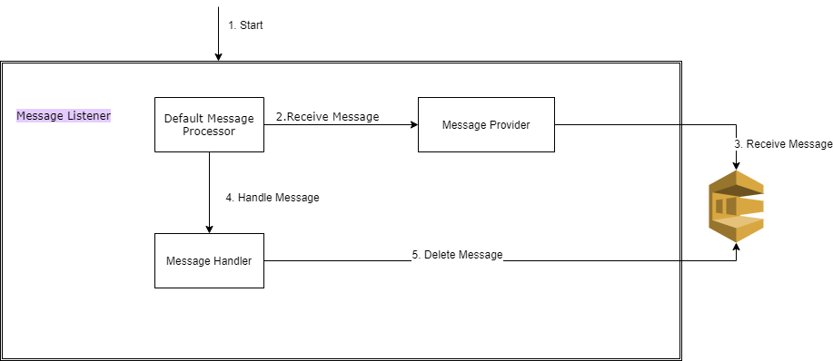

# reactive-sqs-consumer

 

## Introduction

This [reactive sqs consumer](https://github.com/thiyagu06/reactive-sqs-consumer) built with aim to reduce the boilerplate code to launch the sqs consumer and allow the developers to focus on processing the message for implement the business logic.
This has been built from the scratch with a goal making it easy to customizable allowing each component of the library is easy to interchangeable if desired. This also, allows us define custom configuration such as amount of thread to fetch messages and amount of threads to process the messages etc.

The distinguished feature of [reactive sqs consumer](https://github.com/thiyagu06/reactive-sqs-consumer) are

 * Its truly non blocking implementation to maximize throughput and optimize resource utilization by leveraging [Asynchronous AWS SDK for Java 2.0](https://docs.aws.amazon.com/sdk-for-java/v2/developer-guide/basics-async.html) and [Kotlin > Flow](https://kotlinlang.org/docs/reference/coroutines/flow.html)
 * automatic handling of back pressure between [MessageProvider](https://github.com/thiyagu06/reactive-sqs-consumer/blob/master/src/main/kotlin/org/thiyagu/reactive/core/MessageProvider.kt) and [MessageHandler](https://github.com/thiyagu06/reactive-sqs-consumer/blob/master/src/main/kotlin/org/thiyagu/reactive/core/MessageHandler.kt) by using kotlin flows.
 * customize the no of concurrent [MessageProvider](https://github.com/thiyagu06/reactive-sqs-consumer/blob/master/src/main/kotlin/org/thiyagu/reactive/core/MessageProvider.kt) and concurrent no of [MessageHandler](https://github.com/thiyagu06/reactive-sqs-consumer/blob/master/src/main/kotlin/org/thiyagu/reactive/core/MessageHandler.kt) through configuration.
 * abstraction of complexity for fetching and deleting the sqs messages.
 * automatic exception handling of messages using [Dead-Letter Queues](https://docs.aws.amazon.com/AWSSimpleQueueService/latest/SQSDeveloperGuide/sqs-dead-letter-queues.html)
 * better control of defining polling logic for DLQ message by implementing [PollingStrategy](https://github.com/thiyagu06/reactive-sqs-consumer/blob/master/src/main/kotlin/org/thiyagu/reactive/core/PollingStrategy.kt)
 * reduce cost by leveraging [Long Polling](https://docs.aws.amazon.com/AWSSimpleQueueService/latest/SQSDeveloperGuide/sqs-long-polling.html)   
 
## Design

This library is divided into four sub components each with its own responsibilities. The below diagram shows the simple flow of sqs message lifecycle flowing throw each components.

## usage

 See [ExampleUsage.kt](https://github.com/thiyagu06/reactive-sqs-consumer/blob/master/src/it/kotlin/org/thiyagu/reactive/ExampleUsage.kt) for how to use this library.
